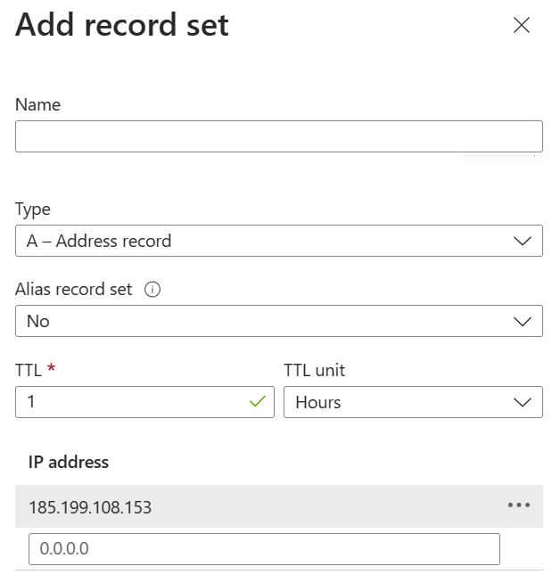

--- 
date: "2023-08-06"
author: "Chun-Hao Lai"
title: "Customized Domain for GitHub Pages"
slug: "customized-domain-for-github-pages"
---

To add a custom domain to your GitHub Pages site, you could acquire a domain from Azure. And use it in GitHub Pages.

## Acquire a domain from Azure

Basically, we could follow this [Buy a custom domain - Azure App Service | Microsoft Learn](https://learn.microsoft.com/en-us/azure/app-service/manage-custom-dns-buy-domain) to acquire a domain from Azure.

My acquired domain is `wilaind.com`.


## Add a custom domain to your GitHub Pages site

Afterward, follow this [Managing a custom domain for your GitHub Pages site - GitHub Docs](https://docs.github.com/en/pages/configuring-a-custom-domain-for-your-github-pages-site/managing-a-custom-domain-for-your-github-pages-site#configuring-an-apex-domain)

It said that to create A records, point your apex domain to the IP addresses for GitHub Pages.

And thus, we could use the azure portal to add the A records as following:



The IP addresses for GitHub Pages are:

```ip
185.199.108.153
185.199.109.153
185.199.110.153
185.199.111.153
```
